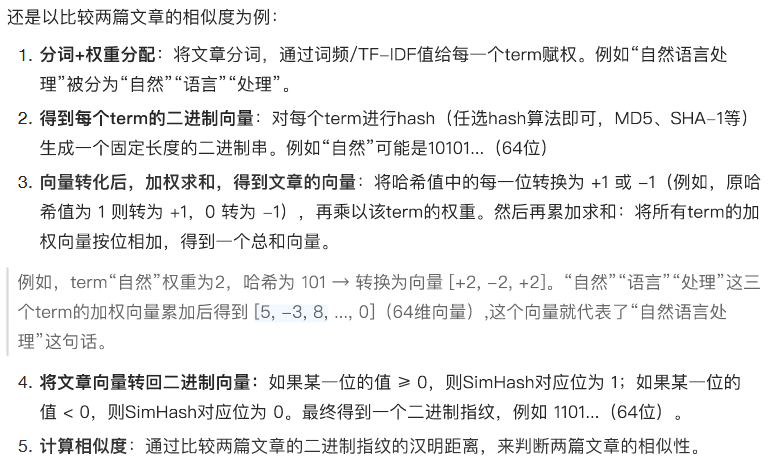

---

---

### SimHash

局部敏感hash:

​	相似的输入在哈希空间中映射为接近的值

​	不相似的输入在哈希空间中映射为远离的值

这种特性使得SimHash能够通过简单的汉明距离计算快速判断两个文本的相似性，而无需直接比较原始高维数据.

**核心思想：**

- 相似性保留：相似的文档生成的哈希值在汉明距离上接近，而差异大的文档哈希值差异显著
- 降维处理：将高维文本特征映射到固定长度的二进制指纹 (如64bit)，便于快速比较

**做法：**

1. 分词 + 权重分配：将文章分词，通过词频/TF-IDF值给每一个term赋权

2. 得到每个term的二进制向量：对每个term进行hash生成一个固定长度的二进制串

3. 向量转化后，加权求和，得到文章的向量：根据每个term的权重和二进制向量加权求和，得到文章的向量

4. 二进制生成指纹（将文章向量转回二进制向量）：将文章向量转为二进制指纹

5. 计算相似度：通过比较两篇文章的二进制指纹的汉明距离，来判断两篇文章的相似性

   | 步骤 | 内容                         |
   | ---- | ---------------------------- |
   | 1    | 分词 + TF-IDF 权重           |
   | 2    | 每个词哈希成固定长度 bit 串  |
   | 3    | bit 串按 1/+w、0/-w 加权求和 |
   | 4    | 大于 0 → 1；小于等于 0 → 0   |
   | 5    | 得到最终 SimHash             |

```python
import re
import hashlib
from collections import Counter

def tokenize(text):
    return list(text)   # 简单按字切分

def compute_tfidf_weights(tokens):
    counter = Counter(tokens)
    total = len(tokens)
    return {word: count / total for word, count in counter.items()}

def hash_to_bits(word, bit_len=64):
    h = hashlib.md5(word.encode("utf-8")).hexdigest()
    binary = bin(int(h, 16))[2:].zfill(128)
    return binary[:bit_len]

def simhash(text, bit_len=64):
    tokens = tokenize(text)
    weights = compute_tfidf_weights(tokens)

    vector = [0] * bit_len

    for word, weight in weights.items():
        bits = hash_to_bits(word, bit_len)

        for i, bit in enumerate(bits):
            if bit == '1':
                vector[i] += weight
            else:
                vector[i] -= weight

    final_bits = ''.join('1' if v > 0 else '0' for v in vector)
    return final_bits

def hamming_distance(hash1, hash2):
    return sum(c1 != c2 for c1, c2 in zip(hash1, hash2))


# 测试文本
text1 = "我爱自然语言处理"
text2 = "我喜欢自然语言分析"
text3 = "天空中有美丽的白云"

hash1 = simhash(text1)
hash2 = simhash(text2)
hash3 = simhash(text3)

print("文本1 SimHash:", hash1)
print("文本2 SimHash:", hash2)
print("文本3 SimHash:", hash3)

print("\n1 vs 2:", hamming_distance(hash1, hash2))
print("1 vs 3:", hamming_distance(hash1, hash3))

```




:star:**为什么要将哈希值的1和0转换为 +1和-1**

在SimHash中，将哈希值的1和0转换为+1和-1的核心目的是通过权重的正负叠加，量化不同词语对最终指纹的贡献方向。这一步是SimHash保留文本相似性的关键

原始哈希值的问题: 若直接使用 1 和 0, 每个词对指纹的贡献只能是“加分” (权重×1) 或“不加分” (权重×0), 无法反映词语对某一位的反向作用。转换为 +1 和 -1 的意义:  正向贡献:哈希值为 1 → 转换为 +1, 权重×+1表示该词支持该位最终为 1。反向贡献:哈希值为 0 → 转换为 -1, 权重×-1表示该词反对该位最终为1(支持该位为 0)。

累加结果的符号:所有词对该位的加权结果相加后:  

- 若总和 ≥ 0,说明支持 1 的权重更强,最终该位为 1;  

- 若总和 < 0,说明支持 0 的权重更强,最终该位为 0。

------

**总结**


------

**例子**

以文本 **“我 爱 自然 语言 处理”** 为例，我们先对分词后的 term 赋予权重（这里为了演示手动设定）：
 “我”(1), “爱”(2), “自然”(3), “语言”(2), “处理”(1)。

**Step 1：为每个 term 生成固定长度的二进制 hash（假设 8bit）**
 我们为五个词设定如下 hash：
 “我”→01011011
 “爱”→11001001
 “自然”→11100010
 “语言”→01111100
 “处理”→00101011

**Step 2：构建 8 维向量并按权重累加**
 SimHash 的核心思想是——对于每个词的 hash：

- bit 为 1，则向量该位累加 +weight
- bit 为 0，则向量该位累加 −weight

初始向量 V 为全 0：

```
V = [0,0,0,0,0,0,0,0]
```

依次累加每个词的贡献：

1）“我”(权重1, 01011011) → V = [-1, +1, -1, +1, +1, -1, +1, +1]
 2）“爱”(2, 11001001) 叠加后 → V = [1, 3, -3, -1, 3, -3, -1, 3]
 3）“自然”(3, 11100010) → V = [4, 6, 0, -4, 0, -6, 2, 0]
 4）“语言”(2, 01111100) → V = [2, 8, 2, -2, 2, -4, 0, -2]
 5）“处理”(1, 00101011) → 最终 V = [1, 7, 3, -3, 3, -5, 1, -1]

这是文本最终的加权向量。

**Step 3：向量二值化（>0 输出 1，否则输出 0）**

```
[1, 7, 3, -3, 3, -5, 1, -1]
→ 1 1 1 0 1 0 1 0
```

**最终 SimHash（8bit）：**

```
11101010
```

这就是该文本的 SimHash 指纹。SimHash 的优势在于：
 相似文本会产生相似的 bit 串，从而可通过汉明距离快速判断文本相似度。

**汉明距离的计算非常快：**

- 本质是两个 64bit 数 XOR 一下
- 再数一数其中 1 的个数（popcount）

这一整个过程是 **CPU 单条指令级别的优化**

​	**64bit  =（8 **Byte字节**）**


传统点积的话(对于一个文本向量来说，实际上会有成千上万甚至上亿的文本向量)：

​	embedding如果是float32 = 4B

​	一个文本向量是 768维 * 4B  = 3KB

```python
dot(x, y) = x1*y1 + x2*y2 + ... + xd*yd
```

对于 768 维向量：

​	768 次乘法

​	768 次加法

​	读取 768 个 float

​	每个 float 是 4 字节（float32）

也就是👇

每次相似度比较至少需要读取：
	768 × 4 字节 ≈ 3KB
而 simhash 只需要：
	64bit = 8 字节