## 冷启动相关:fire:

1. 为什么会出现item冷启动问题(理解:star:)

   - 冷启动就是对于一个新的item,它在用户行为日志里出现的次数很少，导致ID embedding得不到很好的训练，结果等同于随机embedding，进而导致推荐效果差.

     (ID embedding是随机初始化的，之后需要大量训练样本来更新参数，让embedding逐渐学到item的真实语义，但item如果只出现几次，甚至一次都没出现，embedding就相当于没更新，还是随机初始化的结果了)

     (老item：出现次数很多 —> 有大量click/view/purchase行为 —> ID embedding被充分训练

      新item：刚上线 —> 用户几乎没看到过 —>日志里出现次数非常少 —> ID embedding就学不出来)

   - 在工业中，数据都是呈长尾分布的，约有95%的交互样本来自老item, 而新item仅占极少部分，损失函数在梯度更新时主要由老item驱动，使模型过度拟合老item的“记忆性特征"，而不足以学习新item所需的”泛化性特征“（模型是懒惰的）, 因此如果在统一的训练目标下共同优化时，模型会优先优化老item的损失，从而学习到更符合老item的表征，而对新item的特征学习力度不足.

2.  为什么要特殊对待新物品

   - 新发布的 item 缺乏历史交互数据，其 ID embedding 无法获得充分训练，导致模型无法准确捕捉其语义特征，从而出现推荐不准、无法曝光等问题。这是推荐系统中最典型的新物品冷启动挑战. (分发推荐难度大：系统很难把这个item推出去，让用户看到它)

   - 扶持新发布、低曝光的item,可以增强作者发布意愿。

     (在内容平台场景中, 新item通常承载着创作者发布意愿与产品丰富度. 系统若能对新, 长尾, 低曝光 item 给予合理的建模与推荐策略, 可有效激励创作者持续产出内容, 同时提升平台整体内容多样性与用户体验. )

3.  冷启动的目标是什么

   - [用户侧] 精准推荐:克服冷启的困难,把优质的新笔记推荐给合适的用户.
   - [作者侧]激励发布:流量向低曝光新笔记倾斜,激励作者发布.
   - [内容侧]挖掘高潜:通过初期“雨露均沾”的小流量试探,发掘高质量笔记,给予流量倾斜.

4.  为什么仅仅一个ID embedding训不好，影响就这么大

   因为模型参数是由embedding参数 + 网络参数组成的，embedding参数大部分都是ID embedding (user_emb 和 item_emb)，所以ID embedding训得怎么样极大地影响了模型的推荐效果.

   ​	eg: :pushpin:

   ​	假设一个平台：用户数 1 亿, item 数 1,000 万, embedding dim = 64

   ​	那么仅 item embedding 参数量：10,000,000 × 64 = 640,000,000 参数

   ​	用户 embedding：100,000,000 × 64 = 6,400,000,000 参数

   ​	合计 **70 亿+ 参数**（embedding 占 99%）。

   ​	而MLP 网络呢，比如 3 层、512 hidden，大概：

   ​	约 1M - 10M 参数，对比嵌入表完全不值一提。

   ​    （**1M = 1,000,000（100 万）参数 10M = 10,000,000（1000 万）参数**）:smile_cat:

   -----------------------------------------------------------------------------------------------------------------------------------------------------

5. 冷启动召回:fire::fire::fire:(item冷启动)

​	新发布的物品缺少与用户的交互历史，导致一些**基于交互的召回算法**不适用，比如协同过滤召回，双塔模型等，但我们希望在新物品刚发布的时候，就有机会获得曝光，通常可以基于物品的**生命周期**划分为多个阶段，分别**使用不同的召回方法**：

- 在新物品刚刚诞生，没有数据的情况下，主要通过**基于内容的召回算法**，比如**类目召回，聚类召回**等获得曝光的机会

- 随着曝光和交互次数的增长，**基于交互的召回算法双塔模型和协同过滤**逐渐起到了更重要的作用

  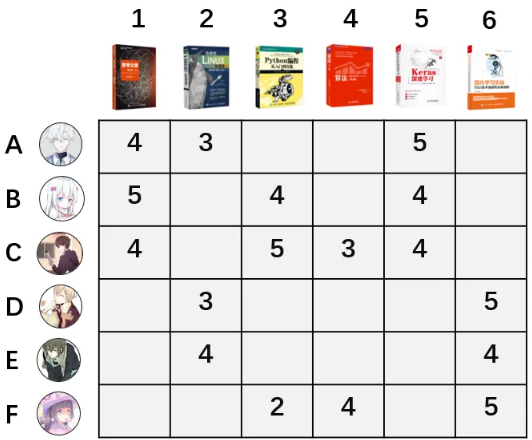

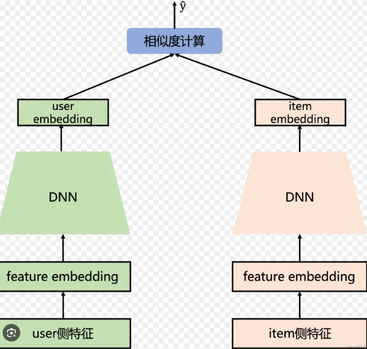

1. 什么是类目召回(本质上还是倒排索引) 新item冷启动

   ​	做内容，电商，社交的互联网公司，都会**维护用户画像**，上面记录了用户的**静态画像如人口统计学特征和行为画像如点击，点赞收藏评论等，以及兴趣画像**，行为数据聚合成高层语义兴趣如类目兴趣，话题兴趣。算法通过分析用户的点击，交互行为，推断出用户感兴趣的二级类目和关键词。比如某个用户感兴趣的二级类目是：美食探店，职场行为，大学教育，关键词包括：历史，日漫，美食等。

   ​	当item刚发布时就有类目标签，系统通过nlp分类模型，图像分类等自动给物品打上类目和关键词标签，这些标签可以用于召回，通过建立从类目到物品的索引，索引上的物品按照发布时间倒排，新item在最前面，新item天然占据流量入口.

   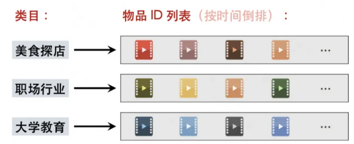

   **类目召回的两个缺点：**

   - 类目召回的本质上是用户画像和物品类目的匹配，但是这样做个性化很弱，召回不够精准。来自类目召回通道的物品 点击率，点赞率，转化率，完播率等指标显示低于大盘指标(N路召回组成的最终结果)，因为类目召回这一路产生的item质量很差，低于平均水平.(大盘指标:比如五路召回的item的集合，点击率是1%，但是有一路召回的item点击率是0.5%, 所以这条召回拖了后腿)
   - 类目召回是按时间倒序排列的，只对刚刚发布的新物品有效，留给新物品的窗口期很短，在几十分钟后，物品就排不到前k，也就没有机会透出 (透出: item 成功被某个召回通道捞出来; 曝光：item 最终展示在用户界面上 )（每小时会有很多很多item产生。例如:item A刚刚产生,5分钟内,没人发请求,它会从第一名的位置被滚动到第500名。当下一次线上请求来临时,类目召回只会取  top 300, 那么item A就永远不会被取到了）

   **如何评判两路召回的优劣**

   ​	比如用户最终买了连衣裙,反推这个连衣裙是哪路召回算法召回来的, 哪路召回就 +1分。

2. 什么是聚类召回（新item冷启动问题）

   ​	聚类召回是基于物品内容的召回通道，也是多模态的应用场景之一. (已知一个老用户点过一个新item)，假如用户喜欢一个物品，那么他会喜欢**内容相似**的物品，比如小红书用户点赞了一篇萌宠笔记，那么系统可以给用户推荐更多萌宠笔记.

   ​	冷启动物品推的不准，但是已知用户会喜欢内容相似的物品，用户点击过一个老item，找和他内容相似的新物品即可，所以用多模态模型提取物品的内容向量，找相似即可。

   —> 如何基于多模态内容预训练一个向量，并用于衡量内容的相似度，比如可以用预训练好的CNN(图片)，或者Bert(文本)提取图文向量：

   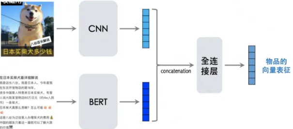

   如果两个物品的图文内容相似，则两个特征向量的余弦相似度较大.

   :smiley_cat:**目的：训练一个多模态模型，这个模型可以产出item的内容向量，用于判断两个item相不相似**

   **(多模态内容向量 + triple loss 为什么合理)**  

   如何训练一个多模态模型，让它为每个 item 输出一个内容向量（content embedding），并且让相似 item 靠得更近，不相似 item 远一点.

    :goal_net: 训练时每次取**一组三元组**：

   - **a = 种子物品**               一张萌宠笔记
   - **b+ = positive**（正样本，内容和 a 相似）                 另一张萌宠笔记（文本/图像内容都很像）
   - **b− = negative**（负样本，内容和 a 不相似）            一条篮球教学视频（内容完全不一样）

   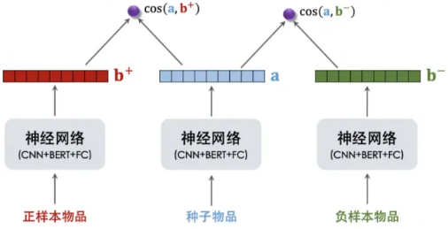

   我们计算三者之间的 **余弦相似度 cos(a, b+)** 和 **cos(a, b−)**

   训练目标：

   - cos(a, b+) **越大越好**（相似内容靠得近）
   - cos(a, b−) **越小越好**（不相似内容远一点）

   于是使用 Triplet Hinge Loss：
   $$
   L(a, b^+, b^−) = \max\{0,\; \cos(a,b^-) + m - \cos(a,b^+)\}
   $$

   - 如果负样本比正样本更靠近锚点（cos(a,b−) > cos(a,b+)），就会产生惩罚
   - 直到网络把它们推开
   - margin（m）决定“推开距离”

   训练完后：

   - 正样本 embedding 聚簇
   - 负样本 embedding 分散

   这个模型就能用来做内容相似度召回了.

   :tokyo_tower:聚类索引

   ​	在训练好多模态神经网络之后, 可以给每一个物品都生成一个特征向量。然后以余弦相似度, 对特征向量做k-means聚类(把内容向量做聚类), 得到 k 个 cluster, 比方说 k = 2048。每个cluster 包含内容相似的item. (k = 2048 代表最终要把所有 item 分成 2048 个簇, 每个簇（cluster_i）都代表一种“内容主题” )

   | k                  | 每个 cluster 大小  | 特点                 |
   | ------------------ | ------------------ | -------------------- |
   | 256                | 太粗，可用性低     | 内容不够区分         |
   | 1024               | 较平衡             | 工业界常用           |
   | **2048（最常用）** | 性能最佳、召回稳定 | 推荐系统常用默认值   |
   | 4096               | 较细粒度           | 适合超大规模内容平台 |

   然后建立正排索引:

   

   和倒排索引:

   

   ​	当一个新物品发布时,用多模态神经网络计算内容向量表征,然后与k个 cluster 中心向量计算余弦相似度,寻找最相似的 cluster,然后添加到上述聚类索引上,排在物品列表的最前面。

   **线上召回 : **

   ​	线上召回的逻辑是“用户 → 交互过的物品 → cluster → 前 m 个物品”。给定用户 ID,  从用户画像取回用户最近交互过的物品, 比方说点赞的 last n、收藏的 last n、转发的 last n、一  共 3n 个物品. 把 3n 个物品叫做种子, 用倒排索引寻找每个种子所在的cluster,然后取回每个  cluster 最新的 m 个物品. 这样一共取回 3mn 个物品(要做一次去重)

3. 什么是双塔召回✔

​	双塔模型是推荐系统中最重要的召回通道,没有之一。但是将双塔模型直接应用于新物品效  果不够好。这是因为物品的 ID embedding 需要通过用户与物品的交互行为学习, 在新物品的点  击次数较少时,物品的 ID embedding 向量还没有学好,进而导致推荐效果差。  default embedding 是一种简单有效的方法:让所用新物品共享一个 default ID, Default embedding 通过让所有新 item 共用一个稳定、充分训练的默认向量，避免了“随机初始化 embedding 无法学习”,而不是用  各自真实的 ID。这样一来, 所有的新物品共享一个 ID embedding 向量,这个ID就不会出现数据 不足的情况了.

default embedding = 所有新物品共同使用的一个特殊 ID embedding

```
item_id = 233430（新） → 用 default_id
item_id = 233431（新） → 也用 default_id
item_id = 233432（新） → 还是 default_id
default embedding 的训练样本数 = 所有新 item 的总量
```

default embedding 是怎么训练出来的

| 方法                                | 工业界使用频率  | 质量   | 说明         |
| ----------------------------------- | --------------- | ------ | ------------ |
| A. 将所有长尾 item 当作一个 ID 训练 | ⭐⭐⭐⭐⭐（最常用） | 稳定强 | 简单有效     |
| B. 取均值                           | ⭐⭐⭐⭐            | 中等   | 工程简单     |
| C. 多模态生成 default               | ⭐⭐⭐             | 强     | 内容平台常用 |

------

✔用户侧冷启动

​	在训练的时候,老用户的样本在数量级上碾压新用户的样本(本来dau就主要是由老用户贡  献,再加上一个老用户能够贡献多条样本),导致模型主要拟合老用户的行为模式,忽略了新用 户。在这种情况下,增加几个对新用户友好的特征是没有用的,因为模型已经被老用户所主导,模 型不care新用户(老用户重视的特征是历史交互序列特征,但是新用户没有。所以对于新用户友 好的特征只能是一些泛化特征、或者标志它是新用户的特征,但老用户根本不在意这些特征,老用户只在意交互序列。因为老用户的数据比较多,模型肯定先顾大头,所以新用户在意什么,模型不会去管),加了也是白加。

解决方式：

- 给新用户的样本加权。有两个问题不太好解决,一是如何设定给这些新用户的权重,二是,  毕竟老用户才是给我们贡献KPI的主力, 给新用户加权,等于变相削弱老用户,可能得不偿失。  

- **干脆分家,就只拿新用户的数据单独训练一套模型,只服务新用户。但是,也有两个问题不好解决,一是新用户数据量少,底层embedding和中间的网络参数可能训练不好;二来, 单独训练, 单独部署, 浪费资源。(经常当成面试题考)** 

  **(新用户 = 刚来的用户 + 低活用户)**

  **《新用户冷启动的本质是缺少行为历史，导致 user embedding 训练不足。最简单的方式是对新用户样本加权，但难点在于权重如何设置，以及过度偏向新用户会损伤老用户效果。也可以为新用户单独训练模型，但由于新用户数据量极低，底层 embedding 和网络参数难以收敛，同时维护两套模型成本太高，因此工业界不会这样做。实际方案是结合人口统计特征、热门召回、类目召回、多模态内容召回、问卷偏好补齐（preference flow）等多源信息；随着用户行为积累，再逐步切换到正常 user-embedding 模型。》**

1. 加强“区分性强”的特征

   通过数据分析,已知新老用户的行为模式有着较大差异(抖音,新用户对视频的点赞率会比  较高,因为新用户第一次来这个平台,觉得很多视频都很稀奇,但是老用户已经看惯了),我们希 望把这一先验知识告诉模型,让模型对新老用户能够区别对待。  首先,我们要构造能够显著标识新用户的特征,比如:  

   一个标识当前用户是否是新用户的0/1标志位  

   用户是否登录  

   首次登录距今时间  

   交互过的item的个数  

   ......  

   如果把这些特征,直接加入到DNN的底层,模型根本不会重视它们。例如,“一个标识当前  用户是否是新用户的0/1标志位”,95%的数据都是1(老用户),5%的数据是0(新用户)。那模 型根本就不会在意这个特征,因为它所含信息量太少了,区分度太低了。(推到极限,如果加了一  个特征,大家的取值都一样,那就相当于没加这个特征)  如何让模型重视起来这些特征呢?  解决方式:可以把这些强bias特征加得离最终的预测值近一些,让它们对最终loss的影响更直接一些。公式:

   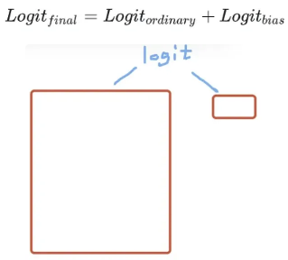

   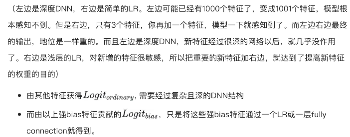

2. 获得良好的初始嵌入

   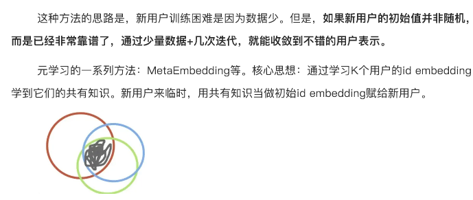

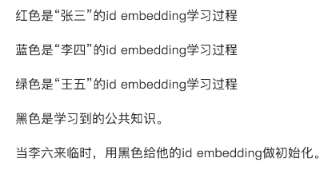

**《为了缓解新用户/新 item 的冷启动问题，我们不使用随机初始化，而是通过 Meta-Embedding 从大量已有 ID embedding 中学习‘共享知识’，并以此作为新 ID 的初始化向量。这样模型在早期就能获得更高质量的 embedding，大幅提升冷启动 CTR 精度。》**


3. **老代新** (面试时讲出来比较好)

找到K个与新用户最相似的老用户
 → 把这些老用户的 embedding 做加权平均
 → 得到一个高质量的新用户 embedding 初始化。

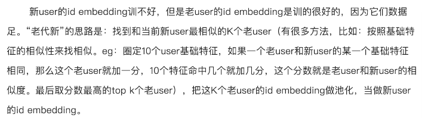

4. 新用户按照某个特征分组，一起更新一个id embedding (共享embedding)

​	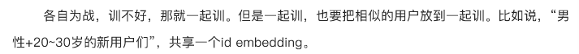

------

:smile:流量调控

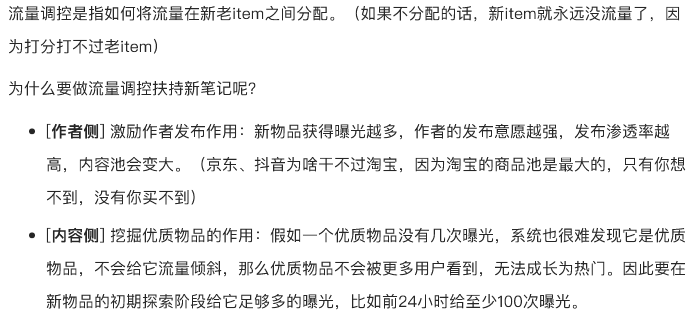

留了调控具体的技术:

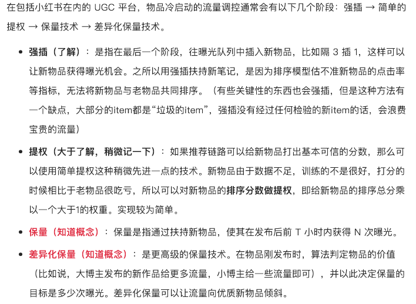